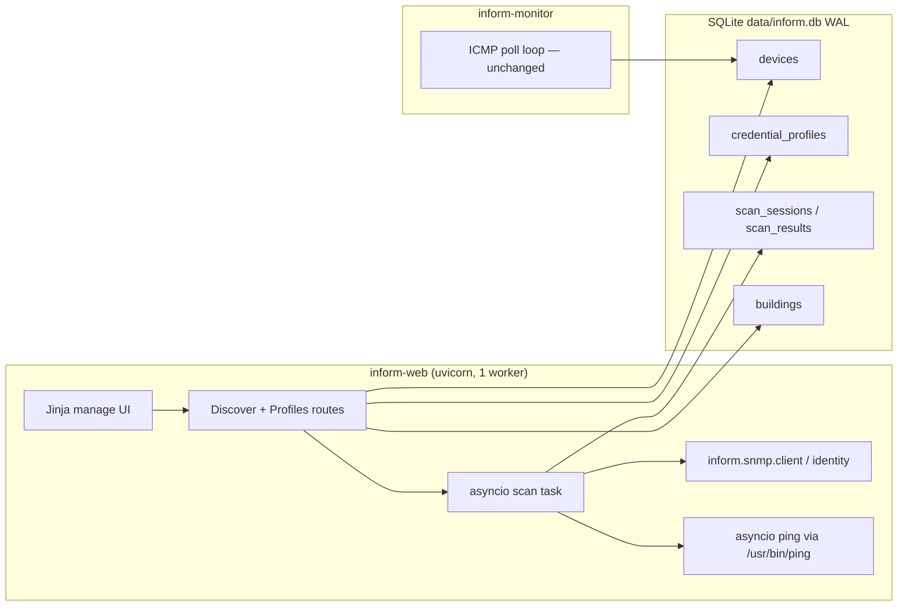
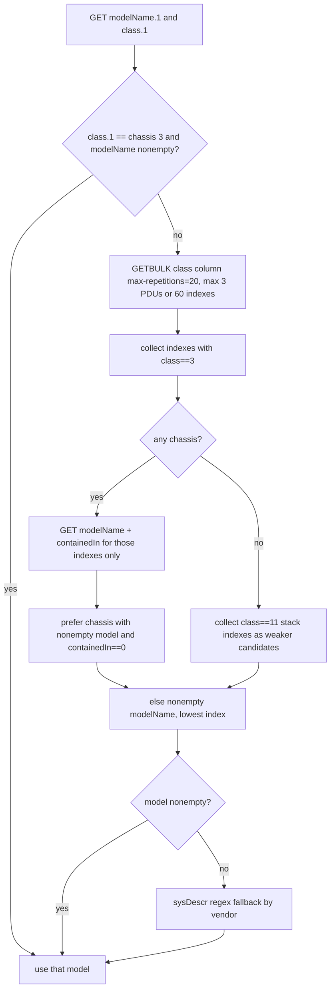
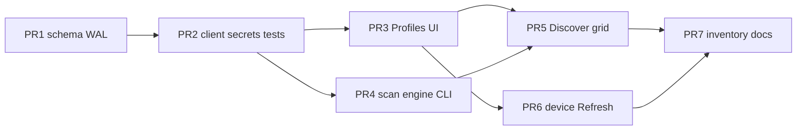

# INfoRM On-Demand SNMP Device Discovery (Scan and Review)

| Field | Value |
| --- | --- |
| **Author** | INfoRM maintainers |
| **Date** | 2026-08-25 |
| **Status** | Draft (revised) |
| **Product** | INfoRM v1.1.3 (`inform/version.py`) |
| **Repo** | `/home/ryanj/projects/INfoRM` |
| **Audience** | INfoRM maintainers and NOC engineers |

---

## Overview

Operators add devices one at a time on `/manage/devices`. SNMP scaffolding exists (`CredentialProfile`, `Device.credential_profile_id`, `inform/snmp/client.py`, CLI `snmp-test`) but was never turned into a workflow. The unused `DiscoveryJob` model is a leftover scheduled-job idea and is **out of scope**.

This design adds an on-demand **Manage → Discover** workflow: the operator enters a single IPv4 address or CIDR, optionally picks a default building and an ordered list of credential profiles, and starts a scan. INfoRM pings first, then SNMPs only live hosts. Results appear in a bulk review grid. The operator checks rows to add, edits name/location/building/comment/asset tag/monitored, and saves selected rows into the existing `devices` table. Already-managed IPs are shown as “in inventory” and are never overwritten by a rescan. Vendor and model are derived from `sysObjectID` + ENTITY-MIB (with a short `sysDescr` fallback), stored as two columns, and updated later only by an explicit **Refresh from SNMP**.

The scan runs as an in-process asyncio task in `inform-web` (not a 90s blocking POST, not a third systemd unit, not `inform-monitor`). SNMP moves from subprocess `snmpget` (v3 `authPriv` only) to `pysnmp>=7.1`, which is already in `requirements.txt` and unused. Credential profiles expand to v1 / v2c / v3 and gain a web UI. Secrets stay out of templates and logs; at rest they are encrypted with a key derived from `SECURITY__SECRET_KEY`.

---

## Background & Motivation

### Current state

INfoRM is a Python 3.12+ FastAPI + SQLite + Jinja2/Bootstrap 5 ICMP reachability monitor. Identity is ping monitoring and a public NOC dashboard grouped by building. Management lives under cookie-authenticated `/manage/*` (`inform/core/auth.py`, fastapi-login).

Relevant scaffolding today:

| Piece | Location | Reality |
| --- | --- | --- |
| Device add/edit | `web/main.py` `save_device`, `web/templates/manage/devices.html` | Building required on add. No credential profile, vendor, or model fields. |
| SNMP client | `inform/snmp/client.py` `get_device_info()` | Shells out to `snmpget -v3 -l authPriv`. Reads sysName / sysLocation / sysDescr. Hardcoded v3. |
| net-snmp | `scripts/install.sh` | **Not installed.** `get_device_info` fails with `FileNotFoundError` on a stock install. |
| pysnmp | `requirements.txt` (`pysnmp>=7.1`, `pycryptodomex>=3.20`) | Installed, unused. |
| Profiles | `CredentialProfile` in `inform/core/models.py`; CLI `add-profile` / `list-profiles` | v3-only columns. Secrets stored plaintext. No web UI. |
| Device↔profile | `Device.credential_profile_id` | CLI `add-device --profile` can set it. Web add path ignores it. |
| DiscoveryJob | `inform/core/models.py` | Table created by `create_all()`. No readers/writers. **Do not wire up.** |
| `discovery.enabled` | `config/config.yaml.example`, `DiscoverySettings` | Printed by CLI `status` only. |
| Monitor | `inform/core/monitor.py`, unit `inform-monitor.service` | Sequential ICMP via `/usr/bin/ping`. `icmplib` is imported and unused — **leave that import; do not clean it up in this work.** |
| Web process | `inform-web.service` | Single uvicorn worker, no `--workers`. |
| Schema | `inform/core/database.py` `init_db()` | `Base.metadata.create_all()` only. No Alembic. `create_all` will **not** add columns to existing DBs. |
| Inventory YAML | `inform/core/inventory.py` `INVENTORY_VERSION = 1` | Buildings + devices. Omits `credential_profile_id`, vendor, model. |

### Pain points

1. Adding a /24 of management switches is dozens of manual form posts.
2. SNMP identity (name, location, vendor, model) is not used at add time, so operators retype what the box already knows.
3. Their switches share one management subnet across many buildings, so a scan-wide required building would be wrong.
4. The existing client cannot run without net-snmp, cannot speak v2c (still common on older gear), and cannot be issued hundreds of times concurrently without forking `snmpget`.

---

## Goals & Non-Goals

### Goals

1. On-demand scan of one IPv4 or one CIDR (max `/24`), ping then SNMP, with progress and cancel.
2. Bulk review grid: operator chooses which live hosts to manage, edits fields, saves into `devices` with the same uniqueness rules as `/manage/devices`.
3. Prefill name from `sysName`, location from `sysLocation`, vendor/model from `sysObjectID` + ENTITY-MIB.
4. Credential profiles for SNMPv3, v2c, and v1; try selected profiles in order; record the winner on the device.
5. Web UI for profiles (create / list / test). CLI `snmp-test` keeps working.
6. Explicit per-device **Refresh from SNMP** for vendor, model, location; name only if asked. Never clobber comment, building, asset tag, or monitored. Selected-row refresh on the Discover grid is out of v1.
7. Additive SQLite schema with a `create_all` + `ALTER TABLE` migrator matching this repo.
8. Stay small. Match existing FastAPI form posts, Jinja2 Bootstrap 5, Typer CLI, SQLAlchemy mapped columns.

### Non-goals

- Scheduled / cron / automatic import. **`DiscoveryJob` stays dormant.**
- IP-range start/end input (CIDR or single IP only).
- Using SNMP for Up/Down. Monitoring stays ICMP in `inform/core/monitor.py`.
- Storing a JSON blob of SNMP attributes, serial numbers, or `sysDescr` in the UI.
- MIB browser, SNMP trap receiver, interface polling, LibreNMS-style inventory.
- Parsing `sysLocation` into buildings.
- Overwriting already-managed devices on rescan.
- A third systemd unit or a job queue.
- Full KMS / HashiCorp Vault. Encryption-at-rest with `SECURITY__SECRET_KEY` is enough.
- IPv6.
- DNS names as scan targets.
- Changing public `/noc` or `/devices` beyond a possible compact vendor/model column — **default: do not** (see Key Decisions).

---

## Key Decisions

Locked product decisions (not reopened) are listed first. Architectural choices made by this design follow.

| # | Decision | Rationale |
| --- | --- | --- |
| K1 | Scan and review only. Do not wire `DiscoveryJob`. | Operators want a supervised bulk-add, not auto-import. The leftover job model is a scheduled-subnet idea and would confuse the UI. |
| K2 | One target field: IPv4 or CIDR. Cap at `/24`. | Matches how they think about management subnets. A `/23` is 510 probes; a `/16` is an accident. |
| K3 | Comment is operator notes. SNMP never writes `Device.comment`, including `sysDescr`. | Comment is human text. `sysDescr` is noisy and version-specific. |
| K4 | Building is operator-owned. Scan default building is optional. Per-row building on review. Selected rows must have a building. SNMP never writes building. | One management subnet spans many buildings. Same required-building rule as `save_device` in `web/main.py`. |
| K5 | Location prefilled from `sysLocation` (`.1.3.6.1.2.1.1.6.0`), then editable. Do not parse into buildings. | Mixed inventory of typed and discovered locations; many new boxes have blank `sysLocation`. |
| K6 | Name prefilled from `sysName` (`.1.3.6.1.2.1.1.5.0`), always editable. Rescan of managed IPs does not overwrite name. | Display name is operator-facing; hostname on the box is a hint. |
| K7 | Store `vendor` and `model` only. Do not store serial. Optionally store `sys_object_id` internally for refresh. | Operators care Cisco vs Palo Alto and 9200 vs 9300. Serial lives in Catalyst Center. |
| K8 | Vendor/model are SNMP-owned and read-only in the UI after save. Updated only by explicit Refresh. Location is mixed (prefill + edit). Name/comment/building/asset tag/monitored are never SNMP-owned after save (name optionally on refresh). | Prevents a later scan from silently renaming a device the NOC already knows. |
| K9 | Try credential profiles in operator-specified order. Persist winning `credential_profile_id`. | Management subnets mix Cisco (often v2c or v3) and Palo Alto (v3). |
| K10 | Ping first; SNMP only on live unmanaged IPs. Ping-only hosts still appear and are addable. Zero profiles is allowed (skip SNMP, mark `no_snmp`). Already-managed IPs always appear on the review list, including when ping fails. | Cuts SNMP traffic. ICMP-only gear is still useful to monitor. A down managed switch must still show as “in inventory,” not vanish. |
| K11 | Do not use SNMP for reachability. | `inform-monitor` remains the source of Up / Pre-Alarm / Down. |
| K12 | **SNMP via pysnmp 7.1 asyncio, not net-snmp.** Rewrite `inform/snmp/client.py`. Do not add `snmp` to `install.sh`. | `pysnmp` is already a dependency. `install.sh` does not install net-snmp, so today’s client is broken on a stock install. Hundreds of `snmpget` subprocesses are a poor fit for a /24. |
| K13 | **Scan runs in `inform-web` as an asyncio task**, with progress in SQLite. Not in `inform-monitor`, not a third unit, not a blocking POST. One scan at a time. | Uvicorn is already a single worker (`systemd/inform-web.service`). Monitor is a synchronous ping loop and must stay isolated. SQLite plus WAL can take incremental result writes. |
| K14 | New tables `scan_sessions` / `scan_results` for the review grid. **Not** `discovery_jobs`. | Ephemeral operator sessions vs. leftover scheduled-job schema. Keep `DiscoveryJob` mapped so `create_all` stays stable, but unused. |
| K15 | Ping for discovery uses the same `ping` binary as `inform/core/monitor.py` `ping_device()`, with an asyncio semaphore. Do not switch to `icmplib`. Leave the unused `from icmplib import ping` in `monitor.py` as pre-existing; do not add a cleanup PR. | The service user `inform` is unprivileged. Ubuntu `iputils-ping` has `cap_net_raw`. `icmplib` needs raw sockets. Monitor already chose subprocess ping for that reason. |
| K16 | Vendor from `sysObjectID` enterprise number via the **day-one map** in `inform/snmp/vendors.py` (Cisco 9, Palo Alto 25461, Juniper 2636, Aruba/HPE Aruba 14823, HP/HPE 11, Dell 674, Fortinet 12356, APC 318, F5 3375, VMware 6876). Model from ENTITY-MIB chassis `entPhysicalModelName`, then `sysDescr` regex fallback. No 10k-OID catalog. Unknown enterprise → display `Unknown ({n})`, not a failed SNMP row. Adding a map line later is a one-line PR. | Operators named this list. Display **APC** (IANA 318, American Power Conversion), not “APC / Schneider”. A product catalog is LibreNMS-sized and goes stale. |
| K17 | Encrypt `auth_key`, `priv_key`, and `community` at rest (AES-256-GCM via existing `pycryptodomex`, key derived from `SECURITY__SECRET_KEY`). Legacy plaintext still decrypts. Never echo secrets in UI or logs. | Credentials are in SQLite today as plaintext. A KMS is out of scope; file mode + app-level crypto is the next step. |
| K18 | Public `/noc` and `/devices` stay ping-focused. Vendor/model appear on **management** devices table and the edit form only. | NOC wall monitors are about Up/Down by building. Inventory fields belong in `/manage`. |
| K19 | Inventory YAML goes to **version 2**: add `vendor`, `model`, `credential_profile` (name, not secrets). v1 files still import. Import never overwrites existing IPs (same skip semantics). | Additive, backup-friendly, no credential leak in a file operators email around. |
| K20 | `discovery.enabled` (default true) hides/disables **scan**, not profile CRUD or Refresh. | Kill switch if a scan is mistaken for an attack, without locking operators out of credentials. |
| K21 | Do **not** enable `PRAGMA foreign_keys=ON`. Keep today’s SQLite default (FKs off). New table FKs are documentary; cleanup is application-level. | `AlarmEvent.device_id` has no `ondelete`. `delete_device` in `web/main.py` works only because FKs are off. Turning them on would `IntegrityError` on any device with history. SQLite cannot `ALTER` those FKs without a table rebuild, which is out of scope. |
| K22 | `data/inform.db` mode **0640** (group `inform` only). Change `ensure_db_permissions()` from `0o664` in PR 1. | Secrets live in this file even before encryption (PR 2). |
| K23 | Scan hard-cap is `/24`. No `/23` confirmation checkbox. | Operator decision. 510 probes is still a sweep. |
| K24 | Refresh from SNMP **overwrites location**, always updates vendor/model/`sys_object_id`, updates name only if the operator checks “also update name”. Never comment/building/asset tag/monitored. | Refresh is explicit; they can cancel. Location from `sysLocation` is the SNMP source of truth on refresh. |

---

## Proposed Design

### High-level architecture

INfoRM remains two systemd units. Discovery is a user-triggered coroutine inside the web process.



`inform-monitor` does not participate. It keeps writing `Device.status` / `response_time` / `AlarmEvent` exactly as today.

### Scan lifecycle

Phases are **sequential**: ping the whole target list, then SNMP only live unmanaged hosts. Do not overlap ping and SNMP as two `par` branches. (Optional micro-pipeline — enqueue a host for SNMP as soon as its own ping returns up — is allowed inside the SNMP phase start, but progress counters and cancel still treat ping-complete then SNMP. Default implementation: two loops.)

```mermaid
sequenceDiagram
  actor Op as Operator
  participant Web as FastAPI (inform-web)
  participant Task as asyncio scan task
  participant DB as SQLite
  participant Host as Target hosts

  Op->>Web: POST /manage/discover/start (target, profiles?, opts)
  Web->>Web: validate CIDR/IP, cap /24, buildings exist
  Web->>DB: IMMEDIATE txn; reject if another running; insert scan_session
  Web->>Task: asyncio.create_task(run_scan); store module-level task ref
  Web-->>Op: 302 /manage/discover?scan=ID
  loop every ~1s
    Op->>Web: GET /manage/discover/status
    Web->>DB: read session counters
    Web-->>Op: JSON progress
  end
  Task->>Host: ping phase (sem=32), all hosts
  Task->>DB: writer coroutine commits scan_results / counters
  Task->>Host: SNMP phase (sem=8), live unmanaged only
  Task->>DB: status=completed (or cancelled/failed in finally)
  Op->>Web: review grid (GET)
  Op->>Web: POST /manage/discover/save (selected rows)
  Web->>Web: identity from scan_results; operator fields from POST
  Web->>DB: INSERT devices (new rows only)
  Web-->>Op: 302 /manage/devices?success=N added
```

#### Task registry, exceptions, cancel (do not use FastAPI `BackgroundTasks`)

`web/main.py` has **no** lifespan or `on_event` today (import only calls `ensure_db_permissions()`). This work adds one.

Module-level in `inform/snmp/scan.py` (imported by web):

```python
_current_task: asyncio.Task | None = None
_current_session_id: int | None = None

def start_scan_task(session_id: int) -> None:
    global _current_task, _current_session_id
    task = asyncio.create_task(run_scan(session_id), name=f"inform-scan-{session_id}")
    _current_task = task
    _current_session_id = session_id
    task.add_done_callback(_on_scan_done)

def _on_scan_done(task: asyncio.Task) -> None:
    """Backstop if run_scan's finally did not run (should be rare)."""
    exc = task.exception() if not task.cancelled() else None
    if exc is not None:
        _mark_session_failed(_current_session_id, f"scan task crashed: {type(exc).__name__}")
```

`run_scan` **must** wrap work in `try/except/finally`. Operator cancel and the watchdog both call `_current_task.cancel()`, so status must **not** be derived from `CancelledError` alone. Persist two distinct flags on `scan_sessions` before cancelling the task:

| Flag | Set by | Terminal status |
| --- | --- | --- |
| `cancel_requested` | `POST /manage/discover/cancel` | `cancelled` |
| `timeout_requested` | in-process watchdog | `failed`, `error_message="timed out"` |

```python
except asyncio.CancelledError:
    # do not write status here — finally reads the flags
    raise
except Exception:
    _mark_session_failed(session_id, type(exc).__name__)  # secret-free
    raise
finally:
    # timeout_requested wins over cancel_requested if both were set
    if timeout_requested:
        status, msg = "failed", "timed out"
    elif cancel_requested:
        status, msg = "cancelled", None
    elif status still in ("running", "cancelling"):
        status, msg = "completed", None
    # write status, finished_at; clear _current_task if it is this task
    snmpEngine.close_dispatcher()
```

Without this, a raised exception is only “Task exception was never retrieved” and the row stays `running` until process restart. Do not rely on “watchdog writes `failed` then cancel overwrites it.”

**Cancel:** `POST /manage/discover/cancel` sets `cancel_requested=1` and `status=cancelling`, then `_current_task.cancel()` if the handle is live. If `_current_task is None` but a row is still `running|cancelling` (orphaned after a crash the lifespan has not yet repaired), mark that row `failed` with `error_message="orphaned; no in-process task"` so Start is not stuck. Cooperative checks:

- Before acquiring the next ping or SNMP **semaphore slot** (each batch is at most `ping_concurrency` / `snmp_concurrency` in-flight).
- Do **not** `asyncio.gather` the entire /24. Use a worker pool or `asyncio.wait(..., return_when=FIRST_COMPLETED)` over the current batch so cancel bound is one ping timeout (~1 s) or one SNMP timeout (~2 s), not the rest of the subnet.
- In-flight ops in the current batch finish or time out; no new work is started.
- Partial `scan_results` remain reviewable.

Do **not** use FastAPI `BackgroundTasks` — they are not cancellable and have no handle.

**One-scan lock:** two concurrent `POST /manage/discover/start` can both see no `running` row if they only `SELECT` then `INSERT`. Take a reserved write lock (`BEGIN IMMEDIATE`) so the SELECT already holds it.

Do **not** do either of these:

- `conn.execute(text("BEGIN IMMEDIATE"))` on a SQLAlchemy 2 connection — `engine.connect()` autobegins, and a nested `BEGIN` fails with `cannot start a transaction within a transaction`.
- `execution_options(isolation_level="IMMEDIATE")` — **not a SQLAlchemy 2 isolation level**. Sqlite3 accepts only `SERIALIZABLE`, `READ UNCOMMITTED`, and `AUTOCOMMIT`. `SERIALIZABLE` only sets `PRAGMA read_uncommitted=0` and still uses a **deferred** `BEGIN`, so it does not lock before the SELECT.

**Chosen: engine-wide `BEGIN IMMEDIATE`** (SQLAlchemy sqlite “non-legacy transactional modes” recipe). Web and monitor already share this engine; immediate transactions reduce `SQLITE_BUSY` from deferred lock upgrades. Do **not** set `dbapi_connection.isolation_level = None` on a single pooled connection and return it — that leaks into the next checkout. Do **not** use `execution_options(isolation_level=...)` together with this recipe (SQLAlchemy warns they fight).

In `inform/core/database.py`, next to the existing WAL connect hook:

```python
@event.listens_for(engine, "connect")
def _sqlite_connect(dbapi_connection, connection_record):
    dbapi_connection.isolation_level = None  # we emit BEGIN ourselves
    cur = dbapi_connection.cursor()
    cur.execute("PRAGMA journal_mode=WAL")
    cur.execute("PRAGMA busy_timeout=30000")
    # Do NOT: PRAGMA foreign_keys=ON  (K21)
    cur.close()

@event.listens_for(engine, "begin")
def _sqlite_begin(conn):
    conn.exec_driver_sql("BEGIN IMMEDIATE")
```

Start-scan then uses a normal transaction; the begin hook emits the reserved lock:

```python
with engine.begin() as conn:
    running = conn.execute(text(
        "SELECT id FROM scan_sessions WHERE status IN ('running', 'cancelling')"
    )).fetchone()
    if running:
        raise ScanAlreadyRunning(running.id)  # context manager rolls back
    # Same transaction: discard_previous checks, optional DELETE of old
    # sessions, INSERT scan_sessions … status=running
```

A second start waits on the reserved lock, then sees the new `running` row. All start checks and the INSERT live in **one** transaction.

**Discard previous review:** keep last session only, but do not silently wipe unsaved work. If the latest session is `completed|cancelled|failed` and has at least one `already_managed=0` row that is not yet in `devices`:

- Start is rejected unless the POST includes `discard_previous=1` (checkbox: *Discard the current review grid and start a new scan*).
- If the last session is `running|cancelling`, reject with a link to Cancel (no discard checkbox).
- Saving to `devices` remains the only way to persist operator edits.

On successful start after confirm, `DELETE FROM scan_results WHERE session_id != :new`; `DELETE FROM scan_sessions WHERE id != :new`.

#### Lifespan (web) and monitor startup

```python
from contextlib import asynccontextmanager

@asynccontextmanager
async def lifespan(app: FastAPI):
    from inform.core.database import ensure_schema
    from inform.snmp.scan import fail_interrupted_sessions, cancel_current_scan
    ensure_schema()  # create_all + migrate_schema; also init_db() and monitor
    fail_interrupted_sessions("interrupted by process restart")
    yield
    await cancel_current_scan()  # web shutdown: cancel task; finally sets cancelled

app = FastAPI(title="INfoRM", version=__version__, lifespan=lifespan)
```

`inform/core/monitor.py` `main()` calls `ensure_schema()` once before the poll loop. `init_db()` is `ensure_schema()` + `ensure_db_permissions()` for `install.sh` / CLI `init-db`. Git-pull-and-restart without `install.sh` still creates missing `scan_sessions` / `scan_results` tables.

`fail_interrupted_sessions`: any `scan_sessions.status in ('running','cancelling')` → `failed` with the given message. Results already written stay.

**Hung-scan watchdog** (same process, started with the scan task): if `status=running` and `now - started_at` exceeds `scan_max_runtime_seconds` (config default **900**; or `total_hosts * (ping_timeout + n_profiles * snmp_timeout) / concurrency + 60`, whichever is larger, capped at 20 minutes), set `timeout_requested=1` **then** `_current_task.cancel()`. `run_scan`’s `finally` is what writes `failed` / `"timed out"` (see flags above). Do not also UPDATE status from the watchdog — that races the `CancelledError` handler. The Discover UI shows a warning after 15 minutes so the operator can Cancel. If the task is already dead and `_current_task is None`, the watchdog (or Cancel) marks the row `failed` directly.

Zero profiles: **allowed**. Skip the SNMP phase; every live unmanaged host gets `snmp_status=no_snmp`. Already-managed hosts still skip SNMP. This is how a camera-only /24 (or a site with no profiles yet) is bulk-added.

### Target parsing

New helper `inform/snmp/targets.py`:

```python
@dataclass(frozen=True)
class ParsedTarget:
    hosts: list[IPv4Address]
    contains_public: bool  # any host with is_global and not is_private

def parse_scan_target(raw: str) -> ParsedTarget:
    ...
```

Contract used by **both** CLI `discover` and `POST /manage/discover/start`:

- Strip whitespace. Reject empty, hostnames, IPv6.
- If the string contains `/`, parse with `ipaddress.IPv4Network(raw, strict=False)`.
  - Reject `prefixlen < 24` (i.e. networks larger than a /24).
  - `/32` → that single host.
  - `/31` → both addresses (RFC 3021).
  - `/24`–`/30` → `network.hosts()` (exclude network and broadcast).
- Else parse `ipaddress.IPv4Address(raw)` → one host.
- Reject any address that is multicast, unspecified (`0.0.0.0`), reserved broadcast (`255.255.255.255`), or loopback if we ever expand — minimum: `is_multicast`, `is_unspecified`, and `ip == 255.255.255.255`.
- Set `contains_public` if any remaining host is not `is_private` (RFC1918 / link-local / etc. per `ipaddress`).
- Maximum length of the resulting list is 254. Reject otherwise.

Public space is **not** a hard reject (some management IPs are public):

- Web: if `contains_public` and POST lacks `confirm_public=1`, re-render the form with *This address is not RFC1918. Check “scan public space” to continue.*
- CLI: `--confirm-public` required when `contains_public`; otherwise exit 2 after a stderr warning. (Do not silently scan public space from a scripted CLI.)

Examples: `10.50.12.10` → one IP. `10.50.12.0/24` → 254 hosts. `10.50.12.10/24` → same 254 hosts (`strict=False`). `10.0.0.0/16` → error. `8.8.8.8` → one host + `contains_public=True`. `224.0.0.1` → error.

### Ping phase

Reuse the same binary and parsing idea as `ping_device()` in `inform/core/monitor.py`, but async:

```python
async def ping_one(ip: str, timeout_s: int, sem: asyncio.Semaphore) -> tuple[bool, float | None]:
    async with sem:
        proc = await asyncio.create_subprocess_exec(
            ping_cmd, "-c", "1", "-W", str(timeout_s), "-n", ip,
            stdout=asyncio.subprocess.PIPE,
            stderr=asyncio.subprocess.DEVNULL,
        )
        try:
            stdout, _ = await asyncio.wait_for(proc.communicate(), timeout=timeout_s + 1)
        except asyncio.TimeoutError:
            proc.kill()
            await proc.wait()  # reap; otherwise a timeout path zombies
            return False, None
        if proc.returncode != 0:
            return False, None
        # same r'time[=<]([\d.]+)\s*ms' extract as monitor.py
```

Always `await proc.wait()` after `kill()`. Wrap in `try/finally` if other exceptions are possible so the child is reaped.

Defaults and caps (also in `DiscoverySettings`):

| Setting | Default | Hard cap | Notes |
| --- | --- | --- | --- |
| Ping timeout | 1 s | 3 s | iputils `-W` is integer seconds |
| Ping concurrency | 32 | 64 | 32 processes is enough; 256 would look hostile |
| SNMP timeout | 2 s | 5 s | pysnmp `UdpTransportTarget` timeout; retries=0 on scan |
| SNMP concurrency | 8 | 16 | SNMP is heavier than ping |
| Max network | /24 | /24 | 254 hosts |

**Who appears on the review list:**

| Host | Ping | Action |
| --- | --- | --- |
| Unmanaged, ping fail | dead | **Drop** — no `scan_results` row |
| Unmanaged, ping ok | live | Insert row; SNMP if any profiles selected, else `no_snmp` |
| Already managed, ping ok or fail | either | **Always insert** a `scan_results` row after ping: `already_managed=1`, `managed_device_id` set, `snmp_status=skipped`, checkbox disabled. Show even if ICMP is down so rescan still lists “in inventory.” **Skip SNMP.** |

Do not hide a managed switch that is down. Unmanaged dead hosts stay omitted (they are not addable).

**Expected duration for a /24** (254 probes):

| Scenario | Ping | SNMP | Total |
| --- | --- | --- | --- |
| Typical management subnet, ~40 live, first profile works, RTT 1–5 ms | ~8 waves × ~0.05 s ≈ 1–8 s (bounded by 1 s timeout on dead IPs → ~8 s) | 40/8 × ~0.2 s ≈ 1 s | **~10–15 s** |
| Sparse, 10 live, first profile works | ~8 s ping (dead-host timeouts dominate) | ~1 s | **~10 s** |
| Worst: all 254 up, 3 profiles all time out at 2 s | ~8 s | 254/8 × 2 s × 3 ≈ 190 s | **~3.5 min** |
| Cancelled mid-scan | partial | partial | immediate stop of new work |

The worst case is why this cannot be a blocking form POST (uvicorn / reverse-proxy idle timeouts). The typical case is a progress bar, not a coffee break.

Log at INFO: user, target, host count, chosen concurrency. This is the audit trail if someone asks “why did we ICMP-sweep that subnet?”

### SNMP client rewrite

Replace `inform/snmp/client.py`. Keep the CLI-facing sync function name `get_device_info` as a thin `asyncio.run` wrapper so `inform/cli/main.py` `snmp_test` stays small. **`get_device_info` is CLI-only.** Calling `asyncio.run()` from a FastAPI route raises `RuntimeError: asyncio.run() cannot be called from a running event loop`. Web, scan, profile Test, and Refresh always `await identify()`. Put a one-line comment on the wrapper: `# CLI only — web must await identify().`

Use PySNMP 7.1 high-level v3arch asyncio (already the package on disk):

```python
from pysnmp.hlapi.v3arch.asyncio import (
    SnmpEngine, CommunityData, UsmUserData, UdpTransportTarget, ContextData,
    ObjectType, ObjectIdentity, get_cmd, bulk_cmd,
    USM_AUTH_HMAC96_MD5, USM_AUTH_HMAC96_SHA, USM_AUTH_HMAC192_SHA256,
    USM_PRIV_CBC56_DES, USM_PRIV_CFB128_AES,
    usmNoAuthProtocol, usmNoPrivProtocol,
)
```

Numeric OIDs only (no MIB compilation, no PySMI). `lookupMib=False` on GET/BULK.

Auth object from a profile:

| `snmp_version` | `security_level` | pysnmp auth |
| --- | --- | --- |
| `v1` | n/a | `CommunityData(community, mpModel=0)` |
| `v2c` | n/a | `CommunityData(community, mpModel=1)` |
| `v3` | `noAuthNoPriv` | `UsmUserData(user)` |
| `v3` | `authNoPriv` | `UsmUserData(user, authKey=..., authProtocol=...)` |
| `v3` | `authPriv` | `UsmUserData(user, authKey=..., privKey=..., authProtocol=..., privProtocol=...)` |

Protocol maps (store lowercase in DB, same as today):

- auth: `md5` → HMAC-MD5-96, `sha` → HMAC-SHA-96, `sha256` → HMAC-SHA-256. Default `sha`.
- priv: `des` → CBC-DES, `aes` / `aes128` → AES-128. Default `aes`.
- Current client hardcodes `-l authPriv` and only sha/md5 + aes/des. Adding `sha256` is cheap and matches modern Cisco defaults.

One `SnmpEngine` per scan (asyncio is single-threaded; do not share across threads). Close it in `run_scan`’s `finally` via `snmpEngine.close_dispatcher()` so repeated Discover runs in long-lived uvicorn do not leak dispatchers. Profile Test / Refresh create a short-lived engine and close it in `finally` the same way.

PySNMP 7.1 `UdpTransportTarget.create` is **async**. Default `retries=5` (plus the first attempt) would turn the documented 3.5 min worst-case /24 into ~20+ minutes if an implementer copies the constructor and omits `retries`. Always:

```python
transport = await UdpTransportTarget.create(
    (ip, 161),
    timeout=snmp_timeout,  # seconds, float
    retries=0,             # scan path: first attempt only
)
# Refresh / snmp-test / profile Test: retries=1
```

Public async API:

```python
@dataclass
class SnmpIdentity:
    sys_name: str | None
    sys_location: str | None
    sys_object_id: str | None
    vendor: str | None
    model: str | None
    profile_id: int | None
    # sysDescr is used internally for model fallback, never returned to templates

class SnmpErrorKind(str, Enum):
    TIMEOUT = "timeout"          # no SNMP response
    AUTH = "auth"                # wrong community / USM failure / authorization
    OTHER = "other"

async def identify(
    engine: SnmpEngine,
    ip: str,
    profiles: Sequence[CredentialProfile],  # already decrypted, in try-order
    timeout: float,
) -> tuple[SnmpIdentity | None, SnmpErrorKind | None, int | None]:
    """Try profiles in order. First successful sysObjectID/sysName GET wins."""
```

**Profile success** = GET of `sysObjectID` (`.1.3.6.1.2.1.1.2.0`) and/or `sysName` returns values (not timeout, not `errorIndication`). Then GET `sysLocation`, `sysDescr` (internal), then model extraction.

**Classification after all profiles:**

- Any success → review `snmp_status = ok`, store winning `profile_id`.
- No success, but at least one SNMP-layer error (`unknownUserName`, `wrongDigests`, `decryptionError`, `authorizationError`, `errorStatus` such as `authorizationError`, v2c `noSuchName` does **not** count as auth — that is a missing OID) → `auth_fail`.
- All timeouts / `errorIndication` transport failures → `no_snmp`.

Do not log community strings, auth keys, or priv keys. Log `profile.name`, IP, and error class only.

CLI `snmp-test` calls `get_device_info()` (sync wrapper). The profile Test form and Refresh **await `identify()`** with a single profile (or the Refresh algorithm below). Show sysName, sysLocation, vendor, model, sysObjectID. They do **not** dump `sysDescr` in the web UI. CLI may print `sysDescr` as a diagnostic line (operators debugging a fallback); web will not.

### Vendor extraction

`inform/snmp/vendors.py` — a dict, not a database table, not a UI. Enterprise number is the fourth arc after `1.3.6.1.4.1.`:

```
sysObjectID = 1.3.6.1.4.1.{enterprise}[.{product}...]
```

Examples: `1.3.6.1.4.1.9.1.2694` → enterprise `9` → Cisco. `1.3.6.1.4.1.25461.2.3.29` → `25461` → Palo Alto Networks.

Day-one map (operator-confirmed; not a SKU catalog). `ENTERPRISE_VENDORS` in `inform/snmp/vendors.py`:

| Enterprise | Vendor string |
| --- | --- |
| 9 | Cisco |
| 25461 | Palo Alto Networks |
| 2636 | Juniper |
| 14823 | Aruba (HPE) |
| 11 | HP / HPE |
| 674 | Dell |
| 12356 | Fortinet |
| 318 | APC |
| 3375 | F5 |
| 6876 | VMware |

Do **not** ship Meraki, Ruckus, Ubiquiti, Arista, Extreme, Net-SNMP, Huawei, etc. on day one. Adding a line later is allowed for unknowns.

Unknown enterprise (OID parses, number not in the map) → `vendor = f"Unknown ({n})"` (example: `Unknown (8072)`). This is a **successful** SNMP identity (`snmp_status=ok`), not auth fail / no SNMP. Empty or unparseable `sysObjectID` → `vendor = None` (blank in UI).

Do **not** map the product suffix (`9.1.2694` etc.) to a SKU. That is the 10k-OID catalog we are refusing to ship.

### Model extraction (ENTITY-MIB chassis)

Primary OID: `entPhysicalModelName` `.1.3.6.1.2.1.47.1.1.1.1.13.{index}`  
Companion: `entPhysicalClass` `.1.3.6.1.2.1.47.1.1.1.1.5.{index}`  
Companion: `entPhysicalContainedIn` `.1.3.6.1.2.1.47.1.1.1.1.4.{index}`

IANA `EntityPhysicalClass`: `chassis(3)`, `stack(11)`, `module(9)`, `port(10)`, …

**Chassis picker** (`inform/snmp/identity.py` `pick_chassis_model(...)`):



Concrete rules:

1. **Fast path.** Many Cisco Catalyst / ISR boxes put the chassis at index 1. Two GETs: `class.1` and `modelName.1`. If class is 3 and model is non-empty (strip quotes/whitespace), stop. This avoids walking 48 port rows.
2. **Limited GETBULK** of `entPhysicalClass` only (`non-repeaters=0`, `max-repetitions=20`). Continue while still in that column, up to **3 GETBULK PDUs or 60 indexes**, whichever first. Also stop on end-of-MIB or OID leaving the class column. Do **not** walk the entire entity tree, and do **not** hard-stop at 40 indexes (that fights the “stay in the class column” rule and misses chassis at high indexes on some stacks). If still no `class==3` after the cap, fall through to sysDescr — **blank model is a successful SNMP identity**, not a failed scan. The review row stays `snmp_status=ok` with vendor filled and model empty.
3. **Chassis set** = indexes where class == 3. If none, use class == 11 (stack) as a fallback set.
4. GET `modelName` and `containedIn` **only for those indexes** (small GET, not a table walk).
5. Rank:
   1. class 3, `containedIn == 0` (or 0.0), non-empty modelName, lowest index
   2. class 3, non-empty modelName, lowest index
   3. class 11, non-empty modelName, lowest index
6. Ignore port/sensor/fan/PSU rows even if they have a model string.
7. Stacked Catalyst: multiple chassis. Taking the **lowest-index chassis model** is correct enough (operators care 9300 vs 9200, not every member SKU). Do not concatenate stack members.
8. If ENTITY-MIB is missing, times out, or all modelNames are empty → `sysDescr` fallback.
9. Truncate model to 100 chars (`Device.model` column width).

**`sysDescr` fallback** (internal; never shown in web UI). Vendor-specific, conservative:

| Vendor | Regex against sysDescr | Example hit |
| --- | --- | --- |
| Cisco | `\b(C9[0-9]{3}[A-Z0-9-]*\|WS-C[A-Z0-9-]+\|ISR[0-9]{4}\|ASR[0-9]{4}\|N[0-9]{1,4}[A-Z0-9-]*)\b` | `C9300-48P` |
| Palo Alto | `\bPA-[0-9]+[A-Z0-9-]*\b` | `PA-3220` |
| Fortinet | `\bFortiGate-[A-Z0-9-]+\b` | `FortiGate-100F` |
| Aruba | `\b(JL[0-9]{3}[A-Z]?\|Aruba [0-9]{4}[A-Z0-9-]*)\b` | `JL357A` |
| Juniper | `\b(EX[0-9]{3,4}[A-Z0-9-]*\|SRX[0-9]{3,4}[A-Z0-9-]*)\b` | `EX4300-48P` |
| F5 | `\bBIG-IP[A-Z0-9 -]*\b` | `BIG-IP` |
| Other / no match | `None` (blank model) | — |

Cisco IOS-XE `sysDescr` often has **no SKU** (`Cisco IOS Software [Cupertino], Catalyst L3 Switch Software (CAT9K_IOSXE), Version 17.9.4a…`). That is why ENTITY-MIB is primary and sysDescr is fallback only.

Do not parse serial (`entPhysicalSerialNum` `.1.3.6.1.2.1.47.1.1.1.1.11`) at all.

### Field ownership matrix

| Field | Scan prefill | Review grid | After save | Refresh from SNMP | Rescan of managed IP |
| --- | --- | --- | --- | --- | --- |
| IP | probe | read-only | unique key | never | shown, not written |
| Name | `sysName` | editable | editable | **only if** “also update name” checked (default off) | not clobbered |
| Location | `sysLocation` | editable | editable | **always overwrite** (K24), even if the operator typed a custom value | not clobbered |
| Vendor | enterprise map | read-only | read-only in UI | **yes** | not clobbered |
| Model | ENTITY-MIB / fallback | read-only | read-only in UI | **yes** | not clobbered |
| `sys_object_id` | yes, hidden | not shown | hidden | **yes** | not clobbered |
| Building | scan default if set, else blank | per-row dropdown | required | **never** | not clobbered |
| Comment | blank | editable | editable | **never** | not clobbered |
| Asset tag | blank | editable | unique if set | **never** | not clobbered |
| Monitored | default true | checkbox | checkbox | **never** | not clobbered |
| `credential_profile_id` | winner if SNMP ok | not edited | set on add if SNMP ok (from **DB row**, not POST) | linked profile only, or operator-chosen / try-all | not clobbered |
| Status / RTT / failures | n/a | n/a | monitor-owned | never | n/a |

Blank SNMP values stay blank (`NULL`). Do not write `"Unknown"`.

`sysName` / `sysLocation` longer than the column (`String(100)`) are truncated.

### Execution module layout

```
inform/snmp/
  __init__.py
  client.py          # rewrite: pysnmp get/bulk, auth from profile, identify()
  identity.py        # vendor + chassis model + sysDescr fallback
  vendors.py         # ENTERPRISE_VENDORS dict
  targets.py         # parse_scan_target
  ping.py            # async ping_one
  scan.py            # run_scan(session_id) orchestrator
inform/core/
  models.py          # CredentialProfile expanded; Device vendor/model/sys_object_id;
                     # ScanSession, ScanResult; DiscoveryJob left unused
  secrets.py         # NEW encrypt/decrypt
  database.py        # WAL + ensure_schema() = create_all + migrate_schema
  config.py          # DiscoverySettings expanded
web/
  main.py            # profiles + discover + refresh routes
  templates/manage/
    profiles.html    # NEW
    discover.html    # NEW
    devices.html     # vendor/model, profile, refresh
    base.html        # nav links
inform/cli/main.py   # add-profile flags, snmp-test, discover command
```

`DiscoveryJob` remains in `models.py` with a docstring: *Unused. Scheduled subnet discovery is out of scope; do not add writers or a jobs UI.* Leaving the table avoids a surprise `DROP` on existing DBs.

### Credential profile management UX

New protected page **Manage → Profiles** (`/manage/profiles`), same auth as buildings (`Depends(manager)`).

List columns: name, version (`v3` / `v2c` / `v1`), identity (show **username in clear**; for community show **“set” / “not set”** only — never last-n of the secret), security level, auth/priv protocol (not keys), description, device count, actions (Edit, Test, Delete).

Create / edit card (same add-or-edit pattern as `manage/buildings.html` and `manage/devices.html`):

- Name (unique), description
- Version radio/select: v3 / v2c / v1; JS shows the relevant fields
- v1/v2c: community (`input type=password`, autocomplete=off). On edit, empty means keep existing.
- v3: username; security level; auth protocol + auth key; priv protocol + priv key. Keys are `type=password`. Empty on edit = keep. Priv fields disabled unless `authPriv`.
- Server-side validation:
  - v1/v2c: community required on create; on edit required unless one is already stored
  - v3 `noAuthNoPriv`: username only
  - v3 `authNoPriv`: username + auth protocol + auth key
  - v3 `authPriv`: all of the above + priv protocol + priv key
- Test: IP field + “Test” button. POST `/manage/profiles/{id}/test`. Result banner: SNMP ok → name / location / vendor / model; or timeout / auth fail. **Never** echo the community or keys back, including on validation errors (re-render with empty password fields).

Delete: confirm. **Application-level** cleanup (FKs stay off — K21): set `devices.credential_profile_id = NULL` for referencing devices; `DELETE FROM discovery_jobs WHERE credential_profile_id = :id` (unused leftover rows; they would not block today but would if anyone later enabled FKs); `UPDATE scan_results SET credential_profile_id = NULL WHERE credential_profile_id = :id`. Do not delete devices.

CLI `add-profile` Typer UX — do **not** leave `prompt=True` on v3 fields when `--version v2c` is set (today every field is `typer.Option(..., prompt=True)`, which would interactively demand auth keys for community profiles):

- Default with no flags: still v3 / `authPriv` (current muscle memory). Prompt username, auth protocol/key, priv protocol/key (keys `hide_input=True`).
- `--version v1` or `--version v2c`: require `--community` (hidden prompt if omitted). **Do not prompt** username, auth, or priv. Store those columns as `""`.
- `--version v3 --security-level noAuthNoPriv`: prompt username only; auth/priv stored `""`.
- `--version v3 --security-level authNoPriv`: prompt username + auth; priv stored `""`.
- `--version v3 --security-level authPriv` (default): prompt all v3 secrets.
- Implementation: `prompt=False` on the optional fields plus a small post-parse wizard that prompts only what the version/level needs. Do not use `typer.Option(..., prompt=True)` for keys that v1/v2c never has.
- `list-profiles` shows version, security level, and username; **does not** print keys or community.
- `snmp-test` uses the new client (v1/v2c/v3) via `get_device_info`.

### Discover UX

Nav in `web/templates/manage/base.html`: Dashboard | Buildings | Devices | **Discover** | **Profiles**. Dashboard card text updated to mention them. `discovery.enabled == false` hides Discover (Profiles stays).

**Scan form** (`GET/POST /manage/discover`):

If `buildings` is empty, show the same warning as `manage/devices.html` (*Add a building before adding devices.*) and **disable Start** (and later Save). Discover cannot satisfy the selected-row building rule without a reference list.

- **Target \*** — placeholder `10.50.12.10 or 10.50.12.0/24`
- **Default building** — optional `<select>` including a blank “— none —”, sourced from `db.query(Building).order_by(Building.name)` (same query as devices). Help text: *Used only as a starting value per row. Switches on one management subnet often live in different buildings.*
- **Credential profiles** — **optional**. Ordered list, not `<select multiple>` (HTML multiple-select posts **document order**, not click order, which would silently ignore K9). Implementation: checkboxes plus up/down buttons, posting `profile_ids=3&profile_ids=1&profile_ids=2` in try order. Zero selected → ping-only scan (`snmp_status=no_snmp` on live hosts). One or more → try in POST order.
- **Scan public space** — checkbox, required only when `parse_scan_target` sets `contains_public`.
- **Discard previous review** — checkbox, required only when the last session has unsaved new rows (see lifecycle).
- **Ping timeout / ping concurrency / SNMP timeout / SNMP concurrency** — number inputs, prefilled from config, clamped to caps. Collapsed under “Scan options” so the default path is target, building, profiles, plus Start.

**Progress** (when `status in (running, cancelling)`): Bootstrap progress bar, counts (`pinged / total`, `live`, `SNMP done`), elapsed time, Cancel button. JS polls `GET /manage/discover/status` every 1 s. When status becomes `completed` / `cancelled` / `failed`, reload the review table (or swap in JSON-rendered rows). Do not auto-refresh the rest of `/manage`.

**Review table** — bulk grid, not the single-device add form:

| Column | Behavior |
| --- | --- |
| ☐ Add | Enabled only if not already managed **and** ping was ok. Header “select all new”. |
| IP | Read-only |
| Status | Badge: **New** or **Already in inventory** (row dimmed, checkbox disabled, inputs disabled). Managed rows appear even when ping failed. |
| Reachability | Ping RTT (e.g. `1.2 ms`) plus SNMP: **ok** / **auth fail** / **no SNMP** |
| Name | Text input, prefilled `sysName` |
| Location | Text input, prefilled `sysLocation` |
| Vendor | Read-only text |
| Model | Read-only text |
| Building | `<select>` of buildings, prefilled from scan default if set, else blank. Not `required` in HTML (unselected rows may be blank). |
| Comment | Text input, empty |
| Asset tag | Text input, empty |
| Monitored | Checkbox, default checked |

Ping-only hosts (live, `no SNMP` or `auth fail`) are addable with blank vendor/model/location. Already-managed rows (including ping-down) are shown, dimmed, checkbox disabled.

Save selected: `POST /manage/discover/save` with `scan_id` and per-row **operator** fields keyed by `result_id` (e.g. `selected=12&name_12=…&building_12=…&location_12=…&comment_12=…&asset_tag_12=…&monitored_12=true`). Server-side:

1. Load each selected `scan_results` row by `(id, session_id)`. Unknown ids → ignore.
2. Ignore rows with `already_managed=1` even if a checkbox is forged. Ignore if `devices` already has that IP.
3. If zero remaining selected → flash error, re-render.
4. If any selected row has empty building → **block the whole save** and name the IPs: `Building is required for: 10.50.12.10, 10.50.12.11`. Same rule as `building: str = Form(...)` on `save_device`. Per-row building `<select>` is the same `Building` query as `/manage/devices` (dropdown-only constraint, matching today’s devices endpoint which also does not re-check the name exists — do not invent a stricter rule here).
5. Unique IP vs `devices.ip_address`; unique `asset_tag` vs existing devices **and** among the selected batch. Empty asset tag → `None` (same as `save_device`: `asset_tag.strip() if asset_tag else None`). SQLite UNIQUE allows many NULLs but not many `""`.
6. **Identity from the DB row, never from POST:** `ip_address`, `vendor`, `model`, `sys_object_id`, `credential_profile_id` (only if `snmp_status == ok`). Forged `ip_address` / vendor / model / profile fields in the POST are ignored.
7. **Operator fields from POST:** `name`, `location`, `building`, `comment`, `asset_tag`, `monitored`.
8. Insert `Device` rows: `status="unknown"`, `failure_count=0`.
9. Redirect to `/manage/devices?success=Added N device(s)`.

Refresh of managed devices stays on the device edit page. A “Refresh selected managed rows” button on the review grid is out of v1.

### Device edit + management table

`web/templates/manage/devices.html` and `save_device`:

- Show **Vendor** and **Model** as read-only text (em dash if null). Not posted, not writable from the form.
- **Credential profile** optional `<select>` (blank = none). Posted and saved. This is the missing web equivalent of `add-device --profile`.
- On edit only: **Refresh from SNMP** button → `POST /manage/devices/{id}/refresh-snmp`. One algorithm (no silent walk of every profile on a production box):
  1. If `device.credential_profile_id` is set → that profile only, `retries=1`.
  2. If unset → the form includes a profile `<select>` defaulting to the first profile **by name**; POST that id. Optional checkbox **Try all profiles** (default **unchecked**). Only if checked, walk all profiles in name order until one succeeds.
  3. On success, **always** overwrite `location` (even if the operator typed a custom value), `vendor`, `model`, `sys_object_id`, and `credential_profile_id`. Refresh is explicit; they can cancel instead of submitting.
  4. Checkbox “Also update name from sysName” default **unchecked**. Name is opt-in only.
  5. Never touches comment, building, asset tag, monitored, IP.
  6. On failure: flash `SNMP refresh failed: timeout|auth|no SNMP` without secrets.
  7. Selected-row refresh on Discover stays out of v1.
- Management table: add compact Vendor and Model columns after Location. Include them in client-side search `data-*` attributes (same pattern as asset tag / comment).

Public `/devices` and `/noc`: **no change**. Justification: those pages exist for ICMP situational awareness (status, RTT, building tiles). Vendor/model is inventory metadata and would crowd the NOC table. Operators who need it are on `/manage/devices`.

### CLI discover

Primary UX is the web grid. A CLI command is still useful for scripting a probe (not for auto-import):

```
inform discover 10.50.12.0/24 --profile cisco --profile palo
inform discover 10.50.12.10 -p campus-v2c
inform discover 8.8.8.8 --confirm-public
```

`--profile` repeatable, in argv order (K9). Zero `--profile` → ping-only. `--confirm-public` required when `parse_scan_target` sets `contains_public`.

Print a Rich table: IP, ping RTT, SNMP status, name, location, vendor, model, already-managed. **No `--json` in v1.** Do **not** write `devices`. No `--import` flag (that would violate scan-and-review). Operators who want add-from-CLI already have `add-device`.

Respect `discovery.enabled`; if false, exit with an error.

**CLI is a probe, not a second session writer.** `inform discover` calls `parse_scan_target`, `ping_one`, and `identify()` (or a `run_scan`-equivalent against an in-memory/temp SQLite used only inside pytest) and prints the table. It **must not** `INSERT`/`DELETE` `scan_sessions` or `scan_results`. Reasons:

- Typer is a different process from uvicorn; `_current_task` is not shared.
- A persisted CLI session would `DELETE` the operator’s unsaved review grid without `discard_previous`.
- A killed CLI could leave `status=running` that web cannot cancel (`_current_task is None`); `fail_interrupted_sessions` only runs on web **start**.

QA the orchestrator in PR 4 with pytest on a `tmp_path` SQLite (`run_scan` + writer coroutine + cancel/timeout flags). Do **not** add a stub Discover web page in PR 4 — that becomes a second UX. The review grid is PR 5. No `--replace-session` flag.

### Concurrency and SQLite

Today: `create_engine(..., connect_args={"check_same_thread": False})` and no WAL. Web and monitor already concurrent-write `devices` (monitor every 30 s, web on form posts). A scan adding dozens of `scan_results` rows makes lock contention real.

In `inform/core/database.py`:

```python
engine = create_engine(
    DATABASE_URL,
    connect_args={"check_same_thread": False, "timeout": 30},
)

@event.listens_for(engine, "connect")
def _sqlite_connect(dbapi_connection, connection_record):
    # Non-legacy sqlite transactions: we emit BEGIN IMMEDIATE (see _sqlite_begin).
    dbapi_connection.isolation_level = None
    cur = dbapi_connection.cursor()
    cur.execute("PRAGMA journal_mode=WAL")
    cur.execute("PRAGMA busy_timeout=30000")
    # Do NOT: PRAGMA foreign_keys=ON
    # AlarmEvent.device_id has no ON DELETE. web.main delete_device
    # succeeds today only because SQLite FKs default off. Enabling
    # them is a regression on any device with alarm history.
    cur.close()

@event.listens_for(engine, "begin")
def _sqlite_begin(conn):
    conn.exec_driver_sql("BEGIN IMMEDIATE")
```

Do not pass `isolation_level="IMMEDIATE"` (not a SQLAlchemy 2 sqlite level). Do not nest `BEGIN` on an autobegin connection. Engine-wide immediate begin is intentional: web + monitor both write this file.

**File mode (K22):** change `ensure_db_permissions()` in `inform/core/database.py` from `os.chmod(db_path, 0o664)` to **`0o640`**. Leave the data directory mode as it is today unless a later hardening pass. PR 1. Do not leave the DB world-readable once profiles (and later encrypted keys) live in it.

**Sessions vs concurrent coroutines:** `SessionLocal()` is **sync SQLAlchemy and not safe to share**. Ping (sem=32) and SNMP (sem=8) tasks must **never** share a Session. Two supported patterns (pick one; default is the writer coroutine):

1. **Single writer coroutine** with `asyncio.Queue`: ping/SNMP workers put result dicts on the queue; one writer `SessionLocal()` / commit / close per item (or batched every 8). Workers do no ORM.
2. **One Session per write** opened inside a dedicated sync helper called via `await asyncio.to_thread(...)` if we ever write from a worker — still one session, one thread, then close.

Blocking `commit()` on the uvicorn event loop is acceptable if brief (a single INSERT). Do not hold a write transaction across SNMP timeouts.

Document in README: `inform-web` must remain a **single worker**. `--workers N` would run N copies of the scan task registry; SQLite session state would still be correct, but cancel would only stop the worker that started the scan. Do not add gunicorn workers in this work.

### Config

`config/config.yaml.example` `discovery:` block:

```yaml
discovery:
  enabled: true
  max_prefix_len: 24          # reject larger networks (/23, /16, …)
  default_ping_timeout_seconds: 1
  default_ping_concurrency: 32
  default_snmp_timeout_seconds: 2
  default_snmp_concurrency: 8
  max_ping_concurrency: 64
  max_snmp_concurrency: 16
  scan_max_runtime_seconds: 900   # watchdog fails a stuck running session
```

Expand `DiscoverySettings` in `inform/core/config.py` with those fields. Existing configs that only have `enabled: true` keep working (Pydantic defaults).

---

## API / Interface Changes

All new HTTP routes sit under `/manage` and use `user=Depends(manager)` (same cookie session as buildings/devices). Existing public routes are unchanged.

### New routes

| Method | Path | Purpose |
| --- | --- | --- |
| GET | `/manage/profiles` | List + add/edit form (`?edit=id`) |
| POST | `/manage/profiles` | Create or update. Password fields optional on update. |
| GET | `/manage/profiles/{id}/delete` | Delete with confirm (same pattern as devices) |
| POST | `/manage/profiles/{id}/test` | Body: `ip`. Returns the profiles page with a result banner. |
| GET | `/manage/discover` | Scan form + current/last session review grid |
| POST | `/manage/discover/start` | Validate and launch asyncio task (`discard_previous`, `confirm_public`, `profile_ids` repeated) |
| GET | `/manage/discover/status` | JSON progress for the active/last session |
| POST | `/manage/discover/cancel` | Cooperative cancel |
| POST | `/manage/discover/save` | Insert selected new devices |
| POST | `/manage/devices/{id}/refresh-snmp` | Explicit identity refresh |

Status JSON:

```json
{
  "id": 12,
  "status": "running",
  "target": "10.50.12.0/24",
  "total_hosts": 254,
  "pinged_count": 128,
  "live_count": 19,
  "snmp_done_count": 12,
  "cancel_requested": false,
  "error_message": null,
  "started_at": "2026-08-25T18:01:02Z",
  "elapsed_seconds": 7
}
```

### Changed routes / templates

- `web/templates/manage/base.html` — nav links Discover, Profiles.
- `web/templates/manage/dashboard.html` — mention Discover / Profiles / inventory.
- `GET/POST /manage/devices` — optional `credential_profile_id`; ignore posted vendor/model; render them read-only.
- `device_to_dict()` in `web/main.py` is public-page facing; **do not** add vendor/model there unless public pages gain columns (they will not).

### CLI

| Command | Change |
| --- | --- |
| `add-profile` | `--version`, `--community`, `--security-level`; wizard prompts only fields that version/level needs (v2c never prompts v3 keys) |
| `list-profiles` | Show version / security level; never keys |
| `snmp-test` | Works for v1/v2c/v3; prints name, location, vendor, model, sysObjectID |
| `discover` | **New.** Probe only; no DB inserts. Rich table only — **no `--json`**. |
| `list-devices` | Add **Vendor** and **Model** columns (low cost; operator decision). |
| `add-device` / `edit-device` | Optional display of vendor/model; `edit-device` does not prompt for them (SNMP-owned) |
| `show-device` | Print vendor, model, profile name (in addition to today’s fields) |
| `status` | Still prints `discovery.enabled` |

### Before / after: `get_device_info`

**Before** (`inform/snmp/client.py`): subprocess `snmpget -v3 -l authPriv` for three OIDs; returns `sysName` / `sysLocation` / `sysDescr` or `{"error": ...}`.

**After:** CLI-only sync wrapper around `identify()` for one profile (`asyncio.run`). Returns `sysName`, `sysLocation`, `sysObjectID`, `vendor`, `model`, or `{"error": ...}`. No `sysDescr` key in the dict used by web. Web/scan/refresh **must not** call this wrapper. CLI may extra-print descr only if `--verbose` is added; default off.

---

## Data Model Changes

### `credential_profiles`

Existing columns stay. **Do not rebuild the table** and do not claim existing secret columns are nullable.

In SQLAlchemy 2.0, `Mapped[str] = mapped_column(String(N))` infers `nullable=False`. `create_all()` on current installs therefore created **NOT NULL** `username`, `auth_protocol`, `auth_key`, `priv_protocol`, `priv_key`. SQLite cannot cheaply drop NOT NULL. Changing the Mapped types to `Optional[str]` only affects **new** databases; existing DBs keep NOT NULL.

| Column | Type | Default | Notes |
| --- | --- | --- | --- |
| `snmp_version` | `VARCHAR(10)` NOT NULL | `'v3'` | New. `v1` / `v2c` / `v3`. Existing rows → v3. |
| `security_level` | `VARCHAR(20)` | `'authPriv'` | New. v3 only; ignored for v1/v2c. Unused → `""` |
| `community` | `TEXT` NULL | NULL | **New**, so NULL is allowed. Encrypted when set. v1/v2c. |
| `username` | `VARCHAR(50)` NOT NULL (existing) | — | v2c/v1 store `""`. Required non-empty for v3. |
| `auth_protocol` | `VARCHAR(10)` NOT NULL (existing) | — | Unused → `""` |
| `auth_key` | existing NOT NULL; ORM `Text` | — | Unused → `""`. Ciphertext stored as TEXT (SQLite ignores VARCHAR length; do not lie with 100/200). |
| `priv_protocol` | `VARCHAR(10)` NOT NULL (existing) | — | Unused → `""` |
| `priv_key` | existing NOT NULL; ORM `Text` | — | Unused → `""` |
| `try_order` | *not stored* | — | Order is per-scan, not global |

Application storage lock: unused fields on existing NOT NULL columns are `""`, never Python `None`. `community` may be `NULL` when the profile is v3. Validation matrix stays as specified (v3 authPriv still requires keys, etc.). `encrypt_secret("")` returns `""` (do not convert empty to NULL — that would fail INSERT on old DBs).

### `devices` — additive

| Column | Type | Notes |
| --- | --- | --- |
| `vendor` | `VARCHAR(100)` NULL | SNMP-owned |
| `model` | `VARCHAR(100)` NULL | SNMP-owned |
| `sys_object_id` | `VARCHAR(256)` NULL | Internal; not shown in tables |

`credential_profile_id` already exists. No JSON column. No serial column.

### New: `scan_sessions` / `scan_results`

```python
class ScanSession(Base):
    __tablename__ = "scan_sessions"
    id: Mapped[int] = mapped_column(primary_key=True)
    target: Mapped[str] = mapped_column(String(50), nullable=False)
    default_building: Mapped[Optional[str]] = mapped_column(String(100))
    profile_ids_json: Mapped[str] = mapped_column(Text, nullable=False)  # [3,1,2]
    ping_timeout_seconds: Mapped[int] = mapped_column(Integer, default=1)
    ping_concurrency: Mapped[int] = mapped_column(Integer, default=32)
    snmp_timeout_seconds: Mapped[int] = mapped_column(Integer, default=2)
    snmp_concurrency: Mapped[int] = mapped_column(Integer, default=8)
    status: Mapped[str] = mapped_column(String(20), default="pending")
    # pending|running|cancelling|completed|cancelled|failed
    total_hosts: Mapped[int] = mapped_column(Integer, default=0)
    pinged_count: Mapped[int] = mapped_column(Integer, default=0)
    live_count: Mapped[int] = mapped_column(Integer, default=0)
    snmp_done_count: Mapped[int] = mapped_column(Integer, default=0)
    cancel_requested: Mapped[bool] = mapped_column(Boolean, default=False)
    timeout_requested: Mapped[bool] = mapped_column(Boolean, default=False)
    error_message: Mapped[Optional[str]] = mapped_column(String(500))
    started_by: Mapped[Optional[str]] = mapped_column(String(50))
    started_at: Mapped[datetime] = mapped_column(DateTime, default=datetime.utcnow)
    finished_at: Mapped[Optional[datetime]] = mapped_column(DateTime)

class ScanResult(Base):
    __tablename__ = "scan_results"
    id: Mapped[int] = mapped_column(primary_key=True)
    session_id: Mapped[int] = mapped_column(ForeignKey("scan_sessions.id"))  # documentary; FKs not enforced
    ip_address: Mapped[str] = mapped_column(String(45), nullable=False)
    already_managed: Mapped[bool] = mapped_column(Boolean, default=False)
    managed_device_id: Mapped[Optional[int]] = mapped_column(ForeignKey("devices.id"))  # app: SET NULL on device delete
    ping_ok: Mapped[bool] = mapped_column(Boolean, default=False)
    ping_rtt_ms: Mapped[Optional[float]] = mapped_column(Float)
    snmp_status: Mapped[str] = mapped_column(String(20), default="skipped")
    # ok|auth_fail|no_snmp|skipped (managed) | n/a
    name: Mapped[Optional[str]] = mapped_column(String(100))
    location: Mapped[Optional[str]] = mapped_column(String(100))
    vendor: Mapped[Optional[str]] = mapped_column(String(100))
    model: Mapped[Optional[str]] = mapped_column(String(100))
    sys_object_id: Mapped[Optional[str]] = mapped_column(String(256))
    credential_profile_id: Mapped[Optional[int]] = mapped_column(ForeignKey("credential_profiles.id"))  # app: SET NULL on profile delete
```

`ondelete="SET NULL"` may be declared on **new** FKs for documentation. SQLite will not enforce it while `foreign_keys` stay off (K21). Application cleanup:

- `delete_device`: `UPDATE scan_results SET managed_device_id = NULL WHERE managed_device_id = :id` (then today’s `db.delete(device)` — alarm history rows remain orphans, as they do now).
- Profile delete: as specified under Profiles UX.

Operator edits (building, comment, asset tag, monitored, edited name/location) live in the **form POST**, not as a second source of truth in `scan_results`. Prefills are stored so a page refresh during review still shows SNMP data. If the operator edits in the grid and reloads without saving to inventory, those edits are lost — acceptable; call it out in help text: *Save selected writes to Devices; reloading this page resets the grid to scan results.*

Keep last session only: on successful start **after** `discard_previous` (when required), `DELETE FROM scan_results WHERE session_id != :new`; `DELETE FROM scan_sessions WHERE id != :new`. (The new row is already inserted.)

### `discovery_jobs`

No schema changes. No UI. No new FKs from scan code. Profile delete **application-deletes** leftover rows (`DELETE FROM discovery_jobs WHERE credential_profile_id = :id`) so a future FK-on experiment cannot block profile CRUD. Do not wire writers or a jobs UI.

### Migration strategy (no Alembic)

This project initializes with `create_all()` (`inform/core/database.py` `init_db()`, called from `scripts/install.sh` and CLI `init-db`). `create_all` creates **missing tables** (`scan_sessions`, `scan_results`) but **does not add columns** to existing `devices` / `credential_profiles`. `migrate_schema()` only `ALTER`s existing tables.

**`init_db()` is not on the service startup path today.** `web/main.py` and `inform/core/monitor.py` only call `ensure_db_permissions()` on import. A “git pull and restart” without `install.sh` would then fail `query(Device)` (`no such column: vendor`) **and** Discover (`no such table: scan_sessions`).

All three paths call **`ensure_schema()`** = `create_all()` then `migrate_schema()`:

1. `init_db()` (install / CLI) — also `ensure_db_permissions()`
2. FastAPI `lifespan` startup (web)
3. `inform.core.monitor.main()` before the poll loop

`create_all()` is idempotent for missing tables. Concurrent web+monitor startup can still race on `ALTER`: both `PRAGMA table_info`, both see a missing column, the second `ALTER TABLE ADD COLUMN` raises `duplicate column name: vendor`. SQLite’s write lock does **not** make check-then-ALTER atomic across two connections. Catch that:

```python
def ensure_schema() -> None:
    from inform.core import models as _models  # noqa: F401 — register metadata
    Base.metadata.create_all(bind=engine)
    migrate_schema()

def _add_column(conn, table: str, column: str, decl: str) -> None:
    if column in _columns(conn, table):
        return
    try:
        conn.execute(text(f"ALTER TABLE {table} ADD COLUMN {column} {decl}"))
    except OperationalError as e:
        if "duplicate column name" not in str(e).lower():
            raise

def migrate_schema() -> None:
    with engine.begin() as conn:
        _add_column(conn, "devices", "vendor", "VARCHAR(100)")
        _add_column(conn, "devices", "model", "VARCHAR(100)")
        _add_column(conn, "devices", "sys_object_id", "VARCHAR(256)")
        _add_column(conn, "credential_profiles", "snmp_version", "VARCHAR(10) DEFAULT 'v3'")
        _add_column(conn, "credential_profiles", "security_level", "VARCHAR(20) DEFAULT 'authPriv'")
        _add_column(conn, "credential_profiles", "community", "TEXT")
        _add_column(conn, "scan_sessions", "timeout_requested", "BOOLEAN DEFAULT 0")
        conn.execute(text(
            "UPDATE credential_profiles SET snmp_version = 'v3' "
            "WHERE snmp_version IS NULL OR snmp_version = ''"
        ))
        conn.execute(text(
            "UPDATE credential_profiles SET security_level = 'authPriv' "
            "WHERE security_level IS NULL OR security_level = ''"
        ))
        # encrypt_legacy_secrets() is NOT called here in PR 1.
        # PR 2 calls it once the new client always decrypt_secret() before use.
```

Do **not** turn on `foreign_keys`. `encrypt_legacy_secrets()` lives in `inform/core/secrets.py` and is invoked from the same three startup paths **only after PR 2** (guard: skip rows already prefixed `enc:v1:`). PR 1 ships `decrypt_secret` as plaintext passthrough so an accidental call is still safe.

**Do not** require operators to delete `data/inform.db`. Alarm history and devices must survive.

SQLite `ALTER TABLE ADD COLUMN` is the supported path; there is no `DROP COLUMN` plan and no table rebuild to drop NOT NULL on `auth_key`.

### Inventory YAML

`INVENTORY_VERSION = 2` in `inform/core/inventory.py`.

Device records gain:

```yaml
vendor: Cisco
model: C9300-48P
credential_profile: campus-v3    # name, never keys
```

`load_inventory_yaml` today **rebuilds** device dicts from a fixed key list and **drops** unknown keys. v2 must add the three keys in **both** `build_inventory` and `load_inventory_yaml`, not only export.

Rules:

- **Export (`build_inventory`):** include `vendor`, `model`, `credential_profile` (profile **name** or `""`). Never community/auth/priv. **Omit `sys_object_id`** — it is an internal refresh cache. A restore without a later Refresh leaves `sys_object_id` NULL; vendor/model in YAML are enough to display. Document this in README.
- **Import v1 files:** missing keys → empty/`None`. Same skip-if-IP-exists semantics (`import_inventory` today). `load_inventory_yaml` currently does not validate `version`; add: if `version` is present and not in `{1, 2}`, raise `ValueError`.
- **Import v2:** copy `vendor` / `model` / `credential_profile` through the cleaned dict. If `credential_profile` name is unknown, add the device anyway with `credential_profile_id=None` (do not skip; do not create a profile from YAML). Increment `stats["profiles_unresolved"]` so CLI import is not silent (`Profiles unresolved: N`). Vendor/model stored as given (operator backup), even though UI treats them as SNMP-owned afterwards.
- **Do not overwrite** vendor/model on skipped (already-present) IPs.
- `import_inventory` stats keys: existing four plus `profiles_unresolved`.

Web export (`GET /manage/export`) automatically picks up `build_inventory()`.

### Secret encryption

New `inform/core/secrets.py`:

- Key: `SHA-256(settings.security.secret_key.encode())[:32]`.
- Algorithm: AES-256-GCM. Import is `from Cryptodome.Cipher import AES` (`pycryptodomex>=3.20` is already in `requirements.txt`; do not add `cryptography`).
- Wire format: `enc:v1:` + urlsafe base64(`nonce[12] || tag[16] || ciphertext`). Overhead is ~45 characters vs plaintext — store ciphertext in ORM `Text` columns, not `String(100)` / `VARCHAR(200)`.
- `encrypt_secret(None)` → `None`. `encrypt_secret("")` → `""` (preserve empty for NOT NULL columns). Idempotent if value already starts with `enc:v1:`.
- `decrypt_secret`: if missing prefix, return as-is (**legacy plaintext**). If prefix present, decrypt or log and treat as missing (do not crash the list page).

**When encryption runs (aligns with rollback):**

| Phase | Encrypt existing rows? | Encrypt on write? | Decrypt before snmpget/pysnmp? |
| --- | --- | --- | --- |
| PR 1 | **No** | **No** (`add-profile` still plaintext) | `decrypt_secret` is passthrough; old `client.py` still sees plaintext |
| PR 2+ | `encrypt_legacy_secrets()` on startup | Yes (`add-profile`, Profiles UI) | New client always `decrypt_secret` before pysnmp |

A *forward* old-client against `enc:v1:` ciphertext is the dangerous direction (`snmpget -A enc:v1:…`). Do not encrypt until the new client is on disk.

**Rotating `SECURITY__SECRET_KEY` breaks decryption.** Document: change the key only together with re-entering profiles (or a future re-encrypt CLI). Session cookies already break on key change (`inform/core/auth.py` LoginManager `secret=`), so this is the same operational constraint.

Application code always `decrypt_secret` when building pysnmp auth (PR 2+). Profiles are written through a helper so the web/CLI cannot forget to encrypt.

---

## Alternatives Considered

### 1. Scan execution: web asyncio vs monitor vs third unit vs blocking POST

| Option | Pros | Cons |
| --- | --- | --- |
| **A. asyncio task in inform-web (chosen)** | No new unit; cancel/progress in the process that owns the UI; matches single-worker uvicorn | Dies on web restart; must persist session in SQLite; must not block the event loop (we await ping/SNMP) |
| B. Drive scans from `inform-monitor` | Long-running process already | Mixes ICMP health with operator jobs; cancel/progress needs IPC; monitor is synchronous `time.sleep` |
| C. Third systemd unit / worker | Clean isolation | Overkill for INfoRM; install.sh / two-unit docs would grow; still SQLite |
| D. Blocking POST | Zero extra machinery | A /24 worst-case is minutes; reverse proxies and browsers time out; no cancel |

A is the smallest design that meets “job with progress + cancel”.

### 2. SNMP library: pysnmp vs net-snmp vs both

| Option | Pros | Cons |
| --- | --- | --- |
| **A. pysnmp 7.1 asyncio (chosen)** | Already in `requirements.txt`; no new apt package; native concurrency; v1/v2c/v3 | API moved in 7.x (`get_cmd`, `UsmUserData`); need to wrap carefully |
| B. Install `snmp` in `install.sh` and keep `snmpget` | Familiar to network engineers | Hundreds of processes; still v3-hardcoded today; extra OS dep; `FileNotFoundError` today proves this path was never productized |
| C. Support both | Escape hatch | Two code paths for a small app |

### 3. Review persistence: memory vs SQLite vs reuse `DiscoveryJob`

| Option | Pros | Cons |
| --- | --- | --- |
| **A. New scan_sessions / scan_results (chosen)** | Survives page refresh; status JSON is trivial; one-scan retention is easy | Two small tables |
| B. In-memory only | Less schema | Lost on refresh/restart; breaks if anyone adds uvicorn workers later |
| C. Wire `DiscoveryJob` | Table already exists | Wrong shape (one profile, `enabled`, `last_run`, no results, no progress). Would grow into a jobs UI, which is explicitly out of scope |

### 4. Vendor/model: enterprise map vs full sysObjectID catalog vs sysDescr-only

| Option | Pros | Cons |
| --- | --- | --- |
| **A. Enterprise map + ENTITY-MIB + sysDescr fallback (chosen)** | Matches “Cisco vs Palo Alto, 9200 vs 9300”; no catalog maintenance | ENTITY-MIB missing on some appliances → sysDescr fallback or **blank model with snmp_status=ok** |
| B. Ship a 10k-OID product catalog | Pretty model names from sysObjectID alone | LibreNMS-sized, stale, not this product |
| C. Parse sysDescr only | One GET | Cisco IOS-XE often has **no SKU** in sysDescr; explicitly rejected as primary |

### 5. Encryption: plaintext vs app-level AES vs KMS

Plaintext is today’s reality and is not acceptable for a profiles UI that invites more secrets. KMS is a non-goal. App-level AES-GCM with the already-required secret key is the middle path. File permissions on `data/inform.db` should also be tightened from `0o664` to `0o640` in `ensure_db_permissions()` while we are here (group `inform` only).

---

## Security & Privacy Considerations

### Threat model (relevant bits)

| Threat | Severity | Mitigation |
| --- | --- | --- |
| Scan used as an internal ping/SNMP sweep from a stolen admin session | Medium | `/manage` cookie already required; cap `/24` and concurrency; INFO log of who scanned what; `discovery.enabled` kill switch |
| Scan looks like an attack to IDS | Low–Med | Document caps; ping-then-SNMP; retries=0; default 32/8; never scan from `inform-monitor` on a schedule |
| SNMP secrets in HTML, query strings, or logs | High if leaked | `type=password`; never re-render secrets; log profile **name** only; `get_device_info` must not include keys in exception strings |
| SQLite stolen from disk | High | Encrypt keys/community at rest; `data/inform.db` mode `0640`; `inform` user nologin |
| CSRF on start/save/delete | Medium | Same-origin cookie `samesite=lax` already (`inform/core/auth.py`). Stay on POST+cookie like existing manage forms. No new JSON mutating GET. |
| Forged “add” of an already-managed IP via save POST | Low | Server loads IP / vendor / model / profile from `scan_results`; ignores forged identity fields; ignores `already_managed` regardless of checkbox |
| Profile test as an SSRF-ish SNMP probe | Low | Authenticated admins only; IPv4 only; no DNS; UDP/161 only |
| `SECURITY__SECRET_KEY` rotation decrypt failure | Med | Document; migrator no-op on already-`enc:v1:`; operator re-enters profiles |
| pysnmp error strings containing community | Med | Sanitize / map to `auth` / `timeout` / `other` before logging or flashing |

### AuthN/Z

No new user model. Every new page uses `Depends(manager)` or the same manual cookie check as `/manage`. Public pages unchanged.

### Data handling

- SNMP never writes comment or building.
- `sysDescr` is not stored and not shown in web templates.
- Inventory YAML contains no secrets.
- Scan results table holds identity fields until the next scan; it does not hold community strings.

### Network safety defaults

Enforced in `parse_scan_target` (CLI and web share it):

- IPv4 unicast only. Reject multicast, unspecified (`0.0.0.0`), and `255.255.255.255`.
- Do **not** hard-require RFC1918. If any host is not `is_private`, require web checkbox `confirm_public` or CLI `--confirm-public`.

---

## Observability

INfoRM has no metrics stack. Stay with logging + UI, consistent with `inform/core/monitor.py`.

### Logging (`inform.discover` logger, stdout + `settings.logging.log_file`)

| Event | Level | Fields (no secrets) |
| --- | --- | --- |
| Scan start | INFO | user, session id, target, host count, profile names in order, concurrencies |
| Scan complete / cancel / fail | INFO | session id, live, snmp_ok, auth_fail, no_snmp, elapsed |
| Per-host SNMP outcome | DEBUG | ip, profile name, ok/auth/timeout |
| Save selected | INFO | user, n inserted, ips |
| Refresh SNMP | INFO | user, device ip, profile name, ok/fail class |
| Schema migrate column added | INFO | table.column |
| Decrypt failure | ERROR | profile id/name only |

Do not log full `sysDescr` at INFO (noise, sometimes contains serials).

### Metrics (optional, cheap)

If we add anything, a scan-session row is already the metric: counts and elapsed live in SQLite and on the Discover page. No Prometheus in this iteration.

### Alerting

None. A failed scan is an on-screen error. A hung scan: UI warning after 15 minutes **and** an in-process watchdog that sets `timeout_requested` then `task.cancel()`; `run_scan`’s `finally` writes `failed` / `"timed out"`. If `_current_task is None`, Cancel/watchdog mark the row `failed` directly. Lifespan startup still marks leftover `running` rows failed after a process restart.

### Health

`GET /health` stays a `SELECT 1`. Do not fail health while a scan runs.

---

## Rollout Plan

### Feature flags

`discovery.enabled` (default `true`) gates Discover scan + CLI `discover`. Profiles and Refresh remain available so operators can set credentials before enabling scans.

No second flag for vendor columns: additive NULLable columns are safe for old rows.

### Staging / install

1. Merge PRs in order (see PR Plan).
2. On Ubuntu 24.04/26.04 lab host: re-run `sudo bash scripts/install.sh` (preserves `data/`, `config/config.yaml`, `.env`; recreates venv so `pysnmp` is present).
3. `init_db()` / web lifespan / monitor `main()` all run `ensure_schema()` (`create_all` + idempotent `migrate_schema`, duplicate-column ALTERs ignored). Encrypt-legacy-secrets runs only once the PR 2 client is present. Git-pull-and-restart without `install.sh` still creates scan tables.
4. Create/confirm profiles in **Manage → Profiles**; Test against a known switch.
5. Discover a single IP first, then a lab `/24`.
6. Confirm `inform-monitor` still pings; Up/Down unchanged.
7. Export inventory; confirm v2 YAML has vendor/model/profile name and no keys.
8. Import the YAML on a scratch DB; v1 fixture still imports.

### Backward compatibility

- Existing devices: `vendor`/`model` NULL until Refresh or a new discover-add.
- Existing v3 profiles: `snmp_version='v3'`, `security_level='authPriv'`; keys remain plaintext until PR 2 startup encrypts them. Unused v3 columns on v2c profiles are `""`.
- CLI `add-profile` without new flags still creates v3 authPriv.
- Inventory v1 files keep working.
- Public NOC/Devices HTML unchanged.
- `DiscoveryJob` table remains; unused.

### Rollback

- **Code rollback:** previous release ignores new columns/tables (SQLite leftover columns are harmless). Old `inform/snmp/client.py` would expect plaintext keys — **do not encrypt until the new client is deployed** (PR 2). Decrypt accepts plaintext, so rolling the UI back after PR 2 still works if `secrets.py` remains. A *forward* old-client against encrypted keys is the dangerous direction — that is why encryption is **not** in PR 1.
- **Practical rollback:** keep decrypt in `secrets.py` even if Discover UI is reverted; or re-enter profiles.
- **Feature off:** `discovery.enabled: false` without a code rollback.
- **Do not** drop columns in a down-migration.

### Risks

| Risk | Severity | Mitigation |
| --- | --- | --- |
| pysnmp 7.x API mismatch / timeout behavior | Med | Spike `identify()` against a lab v2c and v3 box in PR 2 before the UI; pin `pysnmp>=7.1,<8` if 8.x is chaotic |
| ENTITY-MIB walk too heavy on a chassis with hundreds of entities | Med | Fast path index 1; max 3 GETBULKs / 60 class indexes; never walk ports; blank model is success |
| SQLite lock during scan + monitor cycle | Med | WAL + busy_timeout 30s + short commits |
| Operator scans a production /24 with 3 wrong profiles → 3 minutes of UDP/161 | Low | Caps, progress, cancel, ping-first |
| Encrypted secrets unreadable after `.env` regenerate | Med | install.sh already does **not** overwrite `.env`; document |
| Single-worker assumption forgotten | Low | README + unit file stay without `--workers` |
| `username` shown in list-profiles considered sensitive | Low | Usernames are not secrets; communities are masked |

---

## Open Questions

All resolved by operators. Do not re-litigate; do not invent a “default if no input” path.

| # | Question | Status | Resolution |
| --- | --- | --- | --- |
| Q1 | Day-one vendor map | **Resolved** | Ship only: Cisco 9, Palo Alto 25461, Juniper 2636, Aruba (HPE) 14823, HP/HPE 11, Dell 674, Fortinet 12356, **APC 318**, F5 3375, VMware 6876. Vendor string is `APC` (not “APC / Schneider”). Unknown enterprise → `Unknown ({n})`, still `snmp_status=ok`. Adding a line later is allowed. See K16. |
| Q2 | `/23` with extra confirm, or hard-cap `/24`? | **Resolved** | Hard-cap `/24`. No `/23` checkbox. See K23. |
| Q3 | Refresh overwrite of a typed location? | **Resolved** | **Yes overwrite** location. Vendor/model always refresh. Name opt-in checkbox. They can cancel. See K24. |
| Q4 | Tighten `data/inform.db` 0664 → 0640? | **Resolved** | **Yes**, in PR 1 (`ensure_db_permissions`). See K22. Encryption-at-rest remains PR 2. |
| Q5 | CLI `discover --json`? | **Resolved** | **Not in v1.** Rich table only. |
| Q6 | `list-devices` vendor/model columns? | **Resolved** | **Yes**, add Vendor and Model. `show-device` prints them too. PR 6. |

---

## References

- `inform/core/models.py` — `CredentialProfile`, `Device`, unused `DiscoveryJob`
- `inform/snmp/client.py` — current `snmpget` v3 client
- `inform/core/database.py` — `init_db()` / `create_all()` / `ensure_db_permissions()`
- `inform/core/config.py` — `DiscoverySettings.enabled`
- `inform/core/monitor.py` — `ping_device()`, ICMP-only health
- `inform/core/inventory.py` — YAML v1 export/import skip semantics
- `inform/core/auth.py` — cookie sessions, `SECURITY__SECRET_KEY`
- `inform/cli/main.py` — `add-profile`, `list-profiles`, `snmp-test`, `add-device --profile`
- `web/main.py` — `/manage/devices` `save_device` (building required), `/manage/export`; no lifespan today (this work adds one)
- `web/templates/manage/devices.html`, `base.html`, `dashboard.html`
- `scripts/install.sh` — no net-snmp; `init_db()` on install; preserves `data/`
- `systemd/inform-web.service` — single uvicorn worker
- `systemd/inform-monitor.service` — `python -m inform.core.monitor`
- `requirements.txt` — `pysnmp>=7.1`, `pycryptodomex>=3.20`, `icmplib>=3.0` (unused)
- `config/config.yaml.example` — `discovery.enabled: true`
- PySNMP 7.1 hlapi v3arch asyncio: https://docs.lextudio.com/pysnmp/v7.1/
- ENTITY-MIB `entPhysicalClass` / `entPhysicalModelName`: RFC 2737 / RFC 6933
- SNMPv2-MIB `sysObjectID` `.1.3.6.1.2.1.1.2.0`, `sysName` `.1.3.6.1.2.1.1.5.0`, `sysLocation` `.1.3.6.1.2.1.1.6.0`

---

## PR Plan

Incremental, independently reviewable PRs. Each should leave `inform-web` and `inform-monitor` green, with existing devices/buildings/alarms intact. **Do not enable `PRAGMA foreign_keys=ON` in any PR.**



PR 3 ∥ PR 4 after PR 2. PR 6 ∥ PR 5 after PR 3 (does not wait for Discover). PR 7 last.

### PR 1 — Schema, WAL, migrator on process start

- **Title:** `Add SNMP identity columns, scan session tables, and SQLite WAL`
- **Files / components:** `inform/core/models.py`, `inform/core/database.py`, `inform/core/config.py`, `config/config.yaml.example`, `inform/core/monitor.py` (call `ensure_schema` in `main()`), `web/main.py` (lifespan that only runs `ensure_schema` for now)
- **Depends on:** none
- **Changes:** Expand `CredentialProfile` (`snmp_version`, `security_level`, `community TEXT` NULL) and `Device` (`vendor`, `model`, `sys_object_id`). Add `ScanSession` / `ScanResult` with documentary FKs (`timeout_requested` on sessions). Leave `DiscoveryJob` mapped with an “unused” docstring. **`ensure_schema()` = `create_all()` then `migrate_schema()`** on web lifespan, monitor `main()`, and `init_db()`. `_add_column` ignores `duplicate column name`. Enable WAL + `busy_timeout` + engine-wide sqlite `BEGIN IMMEDIATE` (`isolation_level = None` on connect, `exec_driver_sql("BEGIN IMMEDIATE")` on begin). **Do not** set `foreign_keys=ON`. Do not use `isolation_level="IMMEDIATE"`. **Do not** encrypt existing secrets. Optional `secrets.py` may land here with plaintext-passthrough `decrypt_secret` only — no `encrypt_legacy_secrets()` call, no encrypt-on-write. Unused v3 fields stay `""`. Tighten db file mode to **0640** in `ensure_db_permissions()` (K22; was 0664). Expand `DiscoverySettings` (caps including `max_prefix_len: 24`, `scan_max_runtime_seconds`). No UI. Verify migrator on a copied production-like SQLite file **with alarm history** so `delete_device` still works, and on a DB that already has `vendor` so a second ALTER is a no-op.

### PR 2 — pysnmp client, encryption, identity, CLI snmp-test, tests

- **Title:** `Replace snmpget with pysnmp and encrypt credential secrets`
- **Files / components:** `inform/core/secrets.py` (complete encrypt/decrypt + `encrypt_legacy_secrets`), `inform/snmp/client.py` (rewrite), `inform/snmp/identity.py`, `inform/snmp/vendors.py`, `inform/snmp/ping.py`, `inform/snmp/targets.py`, `inform/cli/main.py` (`add-profile` wizard, `list-profiles`, `snmp-test`, `show-device`), `requirements.txt` (pin `pysnmp>=7.1,<8` if needed), `requirements-dev.txt` (new: `pytest>=8`), `tests/` (new)
- **Depends on:** PR 1
- **Changes:** v1/v2c/v3 auth objects; `await UdpTransportTarget.create(..., retries=0|1)`; `identify()`; chassis picker (3 GETBULKs / 60 indexes); **day-one `ENTERPRISE_VENDORS`** (the ten IANA numbers in K16; unknown → `Unknown ({n})`); `parse_scan_target` including unicast/public. CLI: v2c does not prompt v3 keys; `snmp-test` a box. `get_device_info` is CLI-only (`asyncio.run`); comment says web must `await identify()`. **Encrypt-on-write** and `encrypt_legacy_secrets()` on startup. Client always `decrypt_secret` before use. `close_dispatcher()` in `finally`. **Do not** install net-snmp. `ping.py` / `targets.py` land here for testability; they are unused by production paths until PR 4 — that is intentional.
- **Tests:** there is no runner today (`pytest` is not in `requirements.txt`, no `tests/`). Add `requirements-dev.txt` with pytest and a small `tests/` package. Unit tests (pure functions, no live network): target parsing (`/24` accepted, `/23` rejected), enterprise→vendor for the day-one ten plus `Unknown ({n})` for an unmapped enterprise, chassis ranking, sysDescr fallback, encrypt/decrypt round-trip + plaintext passthrough.

### PR 3 — Credential profile web UI

- **Title:** `Add Manage → Profiles for SNMPv1/v2c/v3 credentials`
- **Files / components:** `web/main.py`, `web/templates/manage/profiles.html` (new), `web/templates/manage/base.html`, `web/templates/manage/dashboard.html`
- **Depends on:** PR 2 (needs `await identify()` for Test; encrypt-on-write)
- **Changes:** List/create/edit/delete/test. Username in clear; community “set”/“not set”; never echo secrets. Test **awaits `identify()`**, does not call `get_device_info`. Delete nulls `devices.credential_profile_id` and leftover `discovery_jobs` / `scan_results` profile ids in application code. JS field toggling by version/security level. Wire profile `<select>` on the existing device add/edit form here (unblocks linking without Discover).

### PR 4 — Scan engine, CLI-only QA

- **Title:** `Run on-demand ping-then-SNMP scans as an asyncio job`
- **Files / components:** `inform/snmp/scan.py` (new), `inform/cli/main.py` (`discover` command), `web/main.py` (lifespan: `fail_interrupted_sessions` + shutdown cancel only — **no Discover page**)
- **Depends on:** PR 2
- **Changes:** Module-level task ref; `try/except/finally` status from `cancel_requested` / `timeout_requested` flags; `add_done_callback`; one-scan lock is a normal `engine.begin()` after the engine-wide sqlite `BEGIN IMMEDIATE` hook (not `isolation_level="IMMEDIATE"`, not a nested `BEGIN`); ping-then-SNMP; writer-coroutine Sessions; skip SNMP for managed IPs but still insert their rows (including ping-down); drop only unmanaged dead hosts; zero profiles → ping-only; cooperative cancel between semaphore batches; watchdog sets `timeout_requested` then `task.cancel()`; `close_dispatcher`. CLI `discover` (repeatable `--profile`, `--confirm-public`) is a **probe**: prints a Rich table, **no `--json`**, **does not** write `scan_sessions` / `scan_results`. Orchestrator QA is pytest on `tmp_path` SQLite. **No stub Discover web page.** Enforce `/24` cap and concurrency caps.

### PR 5 — Discover review grid and bulk save

- **Title:** `Add Manage → Discover scan form, review grid, and bulk add`
- **Files / components:** `web/main.py` (discover routes + `delete_device` nulls `scan_results.managed_device_id`), `web/templates/manage/discover.html` (new), `web/templates/manage/base.html`
- **Depends on:** PR 3 (profiles to select), PR 4 (engine)
- **Changes:** Full UX: optional default building, ordered profile list (not `<select multiple>`), `confirm_public`, `discard_previous`, progress poll, review table (managed rows always shown, including ping-down). Save-selected: identity from `scan_results`, operator fields from POST, empty asset tag → `NULL`, building required on checked rows, unique IP/asset_tag, never overwrite managed. Disable Start/Save when there are no buildings. `discovery.enabled` hides this page.

### PR 6 — Device identity on manage UI + Refresh from SNMP

- **Title:** `Show SNMP vendor/model on devices and add Refresh from SNMP`
- **Files / components:** `web/main.py` (`save_device`, refresh route), `web/templates/manage/devices.html`, `inform/cli/main.py` (`list-devices`, `show-device`)
- **Depends on:** PR 2 and PR 3 (profile dropdown). **Parallel with PR 5** — does not need Discover.
- **Changes:** Read-only vendor/model on form and management table. Optional profile on add/edit (if not already wired in PR 3). Refresh: linked profile only; if unset, dropdown defaulting to first by name; “try all” is an explicit checkbox default off. **Always overwrite location, vendor, model, `sys_object_id`.** Name only if checked. CLI `list-devices` gains Vendor and Model columns; `show-device` prints both. Public `/noc` and `/devices` untouched.

### PR 7 — Inventory v2, help/README, polish

- **Title:** `Export vendor, model, and profile name in inventory YAML v2`
- **Files / components:** `inform/core/inventory.py`, `inform/cli/inventory_cmds.py` (help text), `README.md`, `web/templates/help.html`, `CHANGELOG.md`, `inform/version.py` / `VERSION.txt`
- **Depends on:** PR 1 (columns); complete after PR 5–6 so docs match the UI
- **Changes:** Version 2 export/import: add `vendor` / `model` / `credential_profile` to **both** `build_inventory` and `load_inventory_yaml`; `{1,2}` version check; `profiles_unresolved` stat; document omitted `sys_object_id`. Document Discover, Profiles, Refresh, scan caps, secret encryption, key-rotation caveat, single-worker uvicorn, `discovery.enabled`, leftover `icmplib` import. Bump version (e.g. 1.2.0). Help page: new sections for Discover and Profiles; do not claim SNMP health monitoring.
